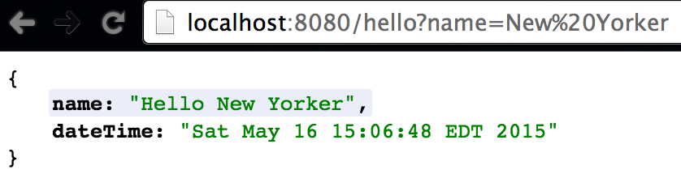
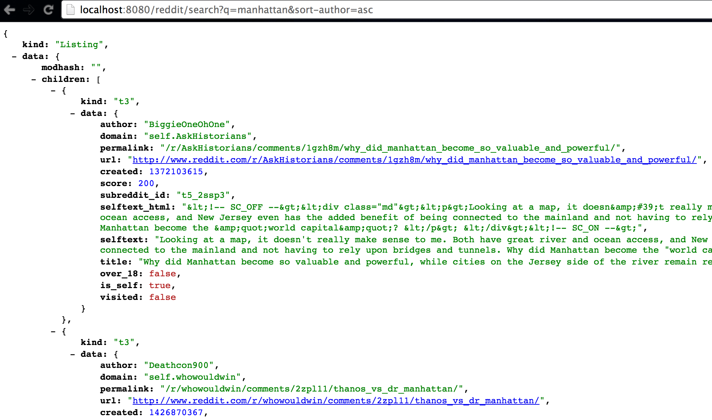
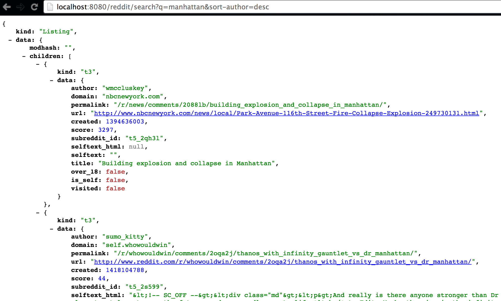

# reddit-rest-service

#### Maven build (requires maven 3):
- $MAVEN3_HOME/bin/mvn clean package
- *For example:* ``` /Users/lli1/about2/apache-maven-3.3.3/bin/mvn clean package ```

___

#### Launch server on port 8080:
``` 
java -jar target/lei-rest-service-0.1.0.jar 
```
or

``` 
java -jar target/lei-rest-service-0.1.0.war 
```

___

#### Test in browser
I made the simplified version of data model, the search API returns simplified version of Reddit document item with less fields comparing with original document.  

*(refresh page if seeing BLANK response or  **429 Too Many Requests** from reddit.com's API.)*
- [http://localhost:8080/hello](http://localhost:8080/hello)
- [http://localhost:8080/hello?name=BigDaddy](http://localhost:8080/hello?name=BigDaddy)
- [http://localhost:8080/reddit/search?q=orchid](http://localhost:8080/reddit/search?q=orchid) (need internet)
- [http://localhost:8080/reddit/search?q=dandelion](http://localhost:8080/reddit/search?q=dandelion) (need internet)
- [http://localhost:8080/reddit/search?q=manhattan](http://localhost:8080/reddit/search?q=manhattan) (need internet)
- [http://localhost:8080/reddit/search?q=Time%20Square&sort-author=asc](http://localhost:8080/reddit/search?q=Time%20Square&sort-author=asc) (sort author in ascending order)
- [http://localhost:8080/reddit/search?q=Time%20Square&sort-author=desc](http://localhost:8080/reddit/search?q=Time%20Square&sort-author=desc) (sort author in descending order)

#### Screenshots
- hello API
<br>

- search API (sort in ascending order)


- search API (sort in descending order)

